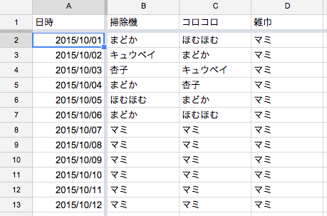
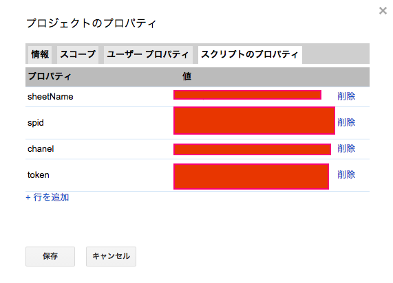

# clean_bot
## 概要
Googleドキュメントのスプレッドシートの掃除当番表を読み込み，当日の当番をSlackに通知する．
## 使い方
### 1.googleスプレッドシートに掃除当番表を作る

下図のような形式で  
B1,C1,D1,E1...は掃除内容  
A2,A3...は日付  

### 2.スクリプトプロパティを設定する
[ツール]＞スクリプトエディタ＞[ファイル]＞プロジェクトのプロパティ＞スクリプトのプロパティ

#### sheetName
掃除当番表を書いたシートの名前 

#### spid
スプレッドシートのURLのkeyの部分  
例:下記URL中の**xxxxxxxxxxx**の部分  
https://docs.google.com/spreadsheets/d/**xxxxxxxxxxx**/edit#gid=0

#### chanel
slack上で通知させるチャンネル名  
例:　#general

#### token
[https://api.slack.com/web](https://api.slack.com/web)の「Authentication」から得られるチームごとに与えられているtokenのこと。

### 3.ライブラリを読み込む
[http://qiita.com/soundTricker/items/43267609a870fc9c7453](http://qiita.com/soundTricker/items/43267609a870fc9c7453)
の「ライブラリを読み込む」を参照＆ありがたく利用

### 4.スクリプトを作る
script.gs.jsの中身をスクリプトにコピペ

### 5.実行（またはトリガーの設定をして実行）
